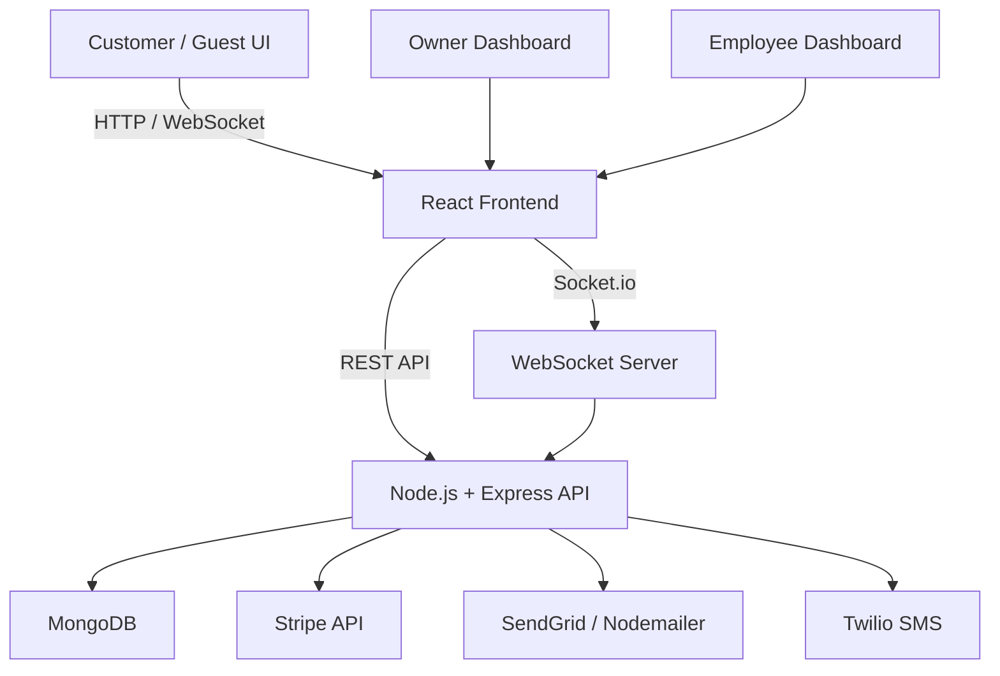

# 🍽️ Restaurant Ordering & Owner Dashboard (MERN)

A full‑stack, production‑grade restaurant web application built with the **MERN stack**. This platform supports **guest checkout**, **user accounts**, **real‑time order updates**, **payments**, **employee management**, and a **live owner dashboard**.

This project is designed to mirror real‑world SaaS and internal tooling patterns used in modern product teams.

---

## 🚀 Features

### Customer / Guest

* Browse menu & categories
* Add items to cart
* Checkout as **guest or registered user**
* Stripe‑powered payments
* Live order status updates
* Order history (registered users)
* Realtime messaging with restaurant staff

### Owner Dashboard

* Secure login
* Create & manage employee profiles
* Live order queue
* Assign employees to orders
* Update order status (Preparing, Ready, Completed)
* CRUD menu items & availability
* View customer messages

### Employee

* View assigned orders
* Update order status
* Chat with customers

---

## 🧱 System Architecture



---

## 🛠️ Tech Stack

### Frontend

* React (Vite or Next.js)
* Tailwind CSS
* TanStack Query (React Query)
* Zustand (cart + session state)
* React Hook Form + Zod
* Socket.io Client
* Stripe JS SDK

### Backend

* Node.js + Express
* MongoDB + Mongoose
* JWT (access + refresh tokens)
* Socket.io
* Stripe Webhooks
* Twilio (SMS notifications)
* SendGrid / Nodemailer (email)

---

## 🔐 Authentication & Roles

| Role     | Access                    |
| -------- | ------------------------- |
| Owner    | Full system access        |
| Employee | Assigned orders + chat    |
| User     | Orders, profile, chat     |
| Guest    | Checkout + order tracking |

* JWT stored in **HttpOnly cookies**
* Role‑based middleware on backend
* Guest orders tracked via secure token

---

## 🧾 Order Flow

1. User/Guest selects menu items
2. Cart persisted client‑side
3. Stripe PaymentIntent created
4. Payment confirmed via webhook
5. Order stored in MongoDB
6. Realtime updates via Socket.io
7. Email + SMS notifications sent

---

## 💬 Realtime Messaging

* Socket.io namespaces per order
* Customers can message staff
* Employees/owners respond in dashboard
* Messages persisted to MongoDB

---

## 📁 Project Structure

```txt
client/
  src/
    app/
    components/
    hooks/
    services/
    store/

server/
  src/
    modules/
    routes/
    middlewares/
    socket.ts
    app.ts
```

---

## 🧪 Security & Best Practices

* Input validation (Zod)
* Rate limiting
* Secure Stripe webhook verification
* RBAC enforcement
* No sensitive data on client

---

## 📈 Future Enhancements

* Analytics dashboard
* Loyalty rewards
* Admin audit logs
* Multi‑location support
* Kitchen display screen

---

## 🎯 Why This Project Matters

This app demonstrates real‑world experience with:

* SaaS dashboards
* Realtime systems
* Payments & notifications
* Role‑based security
* Clean domain‑driven architecture

Built to reflect production engineering standards, not tutorials.

---

## 🧑‍💻 Author

**Ryan Tillman‑French**

